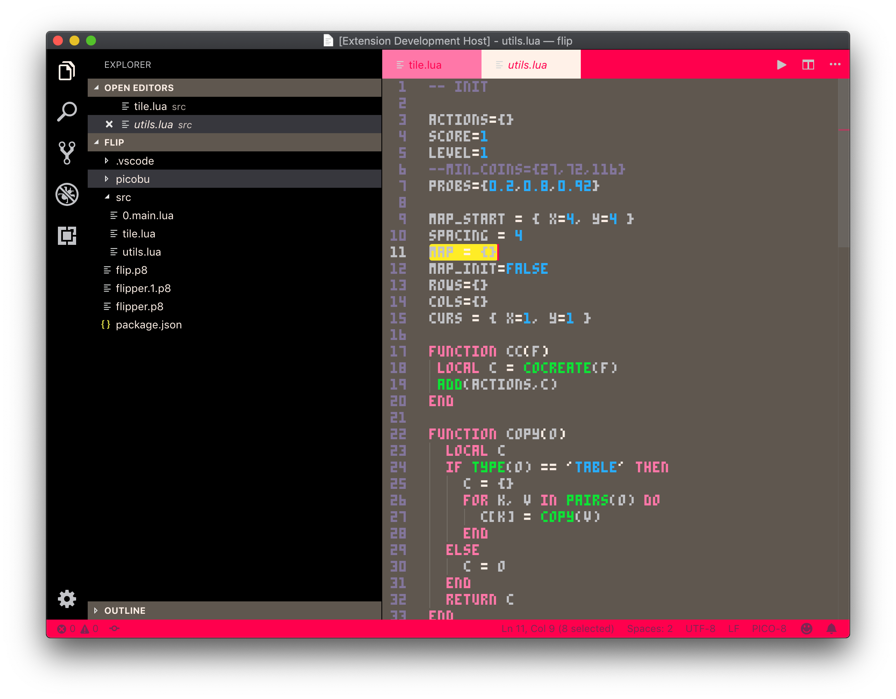

# pico8-theme

A VS Code color theme in the style of the [PICO-8][1] fantasy console by lexaloffle

With this theme, I suggest using the "PICO-8 mono upper" font found [here][2].
This extension contains two themes: "PICO-8", which aims to style everything, and
"PICO-8 Editor-Only", which only styles the code editor and leaves everything else default.

[1]: https://www.lexaloffle.com/pico-8.php
[2]: https://www.lexaloffle.com/bbs/?tid=3760
